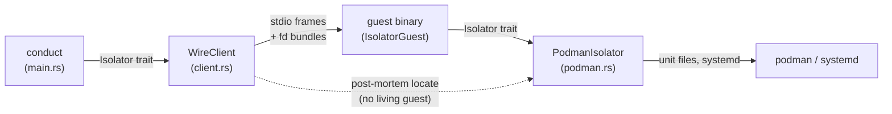
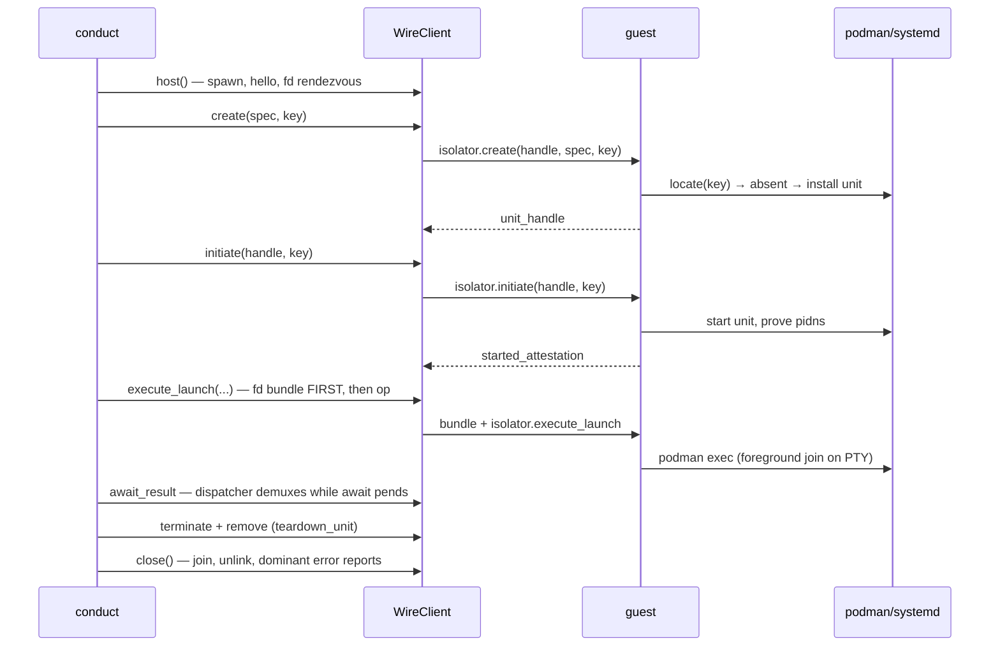
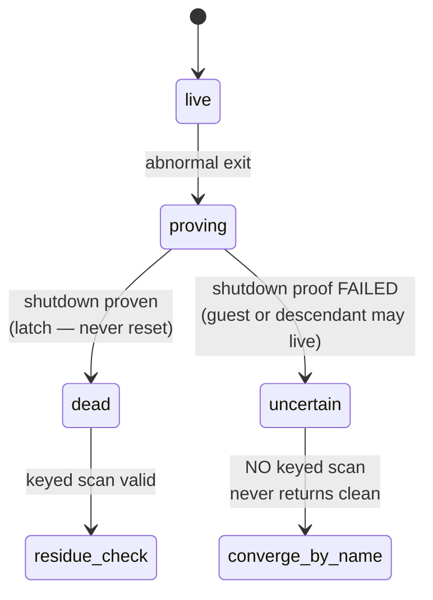

# Isolators

External guest lifecycle: how a session becomes a unit, what happens
when the guest dies, and how a replacement guest converges by key.

## Components

- `conduct` (`src/main.rs`) owns the session. It hosts one guest,
  drives create → initiate → execute → await → teardown through the
  `Isolator` trait, and owns the creation-window lock across install
  and start.
- `WireClient` (`client.rs`) owns the guest process plus the fd
  rendezvous. It implements `Isolator` by translating trait calls
  into `isolator.*` wire ops; one dispatcher thread owns the
  exchange and demultiplexes replies by request id.
- The guest binary (`src/bin/cistella-isolator-podman.rs`) owns the
  stdio loop. Op semantics live in `IsolatorGuest` (`wire.rs`), so
  host and guest share one dispatch and cannot drift.
- `PodmanIsolator` (`podman.rs`) is both the guest's engine and the
  in-process conformance reference. `quadlet.rs` owns unit mechanics.

Handles are framework-minted opaque strings end to end. The guest
binds each framework handle to a local handle plus the attempt
identity (reconciliation key, and spec/argv for create/launch) that
created it. Guests never invent handles. Successful `remove`
evicts the live binding into a removal tombstone keyed by the
original handle: identical `terminate`/`remove` retries delegate
idempotent backend cleanup (residue-free convergence, never
resurrection), `state`/`inspect` synthesize absence without backend
contact, and divergent live attempts — including same-handle
`create`, which must never resurrect — refuse typed. The retained
local reaches only the backend tombstone. Both backends implement
the same tombstone rule, so parity holds through teardown.



## Happy-path sequence



The bundle-before-op ordering is load-bearing: the guest blocks in
`recv_bundle` after receiving the op, so awaiting the response
before sending would deadlock (`client.rs`).

## Death observation (the death latch)

When the guest exits abnormally, the dispatcher attempts a bounded
shutdown/reap before failing pending callers. The outcome is one of
two states — never a guess:



- `dead` (`client.rs:130`) latches only after proven shutdown.
  Conduct's `death_checked` (`client.rs:414`) then runs the residue
  check: every recorded attempt key must locate to nothing, or the
  residue dominates the report.
- `uncertain` (`client.rs:137`) means the proof failed. No keyed
  scan runs beside a possible-live mutator; `teardown_unit`
  converges best-effort by name but never returns `Ok` — unverified
  quiescence must never masquerade as clean, even when the snapshot
  is empty (a survivor could install after the check).

## Key reconciliation matrix

Every mutating op carries the framework-issued reconciliation key.
A fresh guest (empty tables) converges by locating durable state —
never by guest-side recovery state:

| `isolator.create` arrives with | guest does |
|---|---|
| known handle, same key + spec | idempotent replay, no backend call (`wire.rs:401`) |
| known handle, different key/spec | typed refuse — never rebinds out from under the first attempt |
| unknown handle, key locates (`podman ps` label, else unit file) | adopts the surviving unit (`podman.rs:141`) |
| unknown handle, key locates nothing | creates (fail-closed scan: query failure refuses, never installs blind) |

`PodmanIsolator::create` repeats the locate-before-create itself, so
same-key retry replays instead of duplicating (`podman.rs:323`).
Re-initiate after adopt is safe: `start_quadlet` returns `Ok` on an
already-active unit. Execute/await has no resurrection path by
design — execution ownership (child, PTY binding, outcome) dies
with the guest and must not be reaped from a stranger; the
framework converges to clean via typed teardown instead.

## Pre-exec recovery

A guest death during pre-exec ops (create/initiate) converges by
spawning a fresh guest and replaying the same key, instead of
failing the session:

- **Conduct retire-and-replace.** The dead client's latches
  stay immutable; conduct closes/retires it, hosts a fresh
  `WireClient` under the still-held creation-window guard, and
  replays the same key/spec with a NEW framework handle (adopt
  path binds it — handles differ, unit identity converges).
  Rejected: in-client self-heal (would reset the death latch).
- **Proven death only** (`guest_dead && !shutdown_uncertain`),
  intercepted before `death_checked` — on the recovery path a
  located unit is the expected survivor, not residue. Uncertain
  never re-execs.
- **One bounded replacement for the whole pre-exec episode**
  (create+initiate), not one per op. Second death fails stop:
  second error dominant, first retained as context. Re-host
  failure converges directly by name with a residue-dominant
  report (never nested teardown under the held lock).
- **Launch boundary: death detected at `execute_launch`
  submission is execution-boundary, NEVER pre-exec.** The guest
  spawns the harness (`podman exec`) BEFORE replying, so no-reply
  does not prove no execution existed — a spawned child may
  outlive the guest, and re-launch could run the harness twice.
  Typed teardown, never replay. Narrow exception: provably LOCAL
  refusal before the
  op can reach the guest (fd clone/bundle send failure) is a
  local error, not a death — named separately, retries nothing.

```mermaid
sequenceDiagram
    participant C as conduct
    participant W1 as WireClient (dead)
    participant W2 as WireClient (fresh)
    participant G2 as new guest
    C->>W1: create → guest dies, dead latches
    C->>W1: close() — retire; join + unlink unconditional
    C->>W2: host() — same rendezvous dir, same key
    C->>W2: create(NEW handle, SAME key/spec)
    W2->>G2: isolator.create → key locates → adopt
    G2-->>W2: unit_handle (new handle, same unit)
    C->>W2: initiate → start idempotent → continue
```
